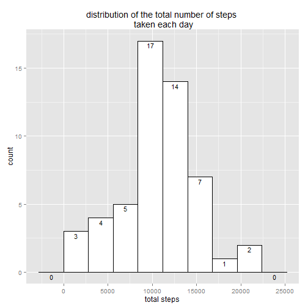
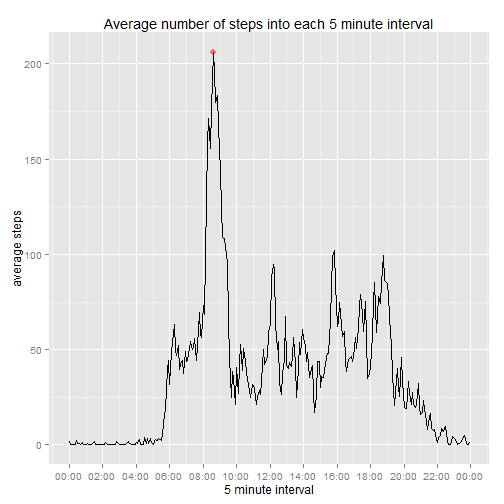
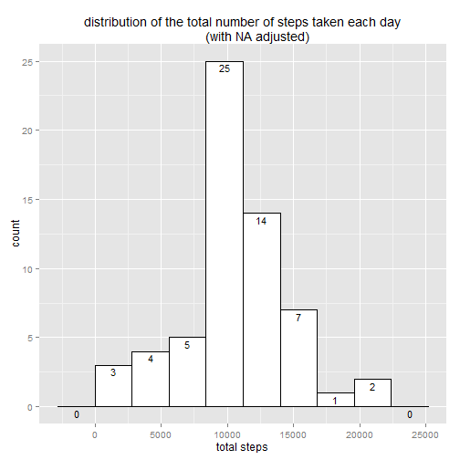
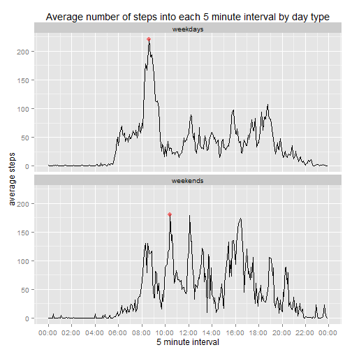

# Reproducible Research: Peer Assessment 1

## Loading and preprocessing the data

### necessary packages in R

```r
library(dplyr)
library(ggplot2)
library(scales)
```

### 1- Getting data
In the rubric of the Assignment there is a NOTE: "The GitHub repository also contains the dataset for the assignment so you do not have to download the data separately".
So, when we clone the GitHub repository to local repo, we download also the zip file containing the dataser in this local directory. For getting the data, we must only unzip and read this zip file. 

```r
if (!file.exists("activity.csv")){
    unzip("activity.zip")
}
if (!exists("data_o")){
data_o<-read.csv("activity.csv",header= TRUE)    
}
data<-data_o
data<-tbl_df(data)
```
We can see the three variables with:

```r
head(data)
```

```
## Source: local data frame [6 x 3]
## 
##   steps       date interval
## 1    NA 2012-10-01        0
## 2    NA 2012-10-01        5
## 3    NA 2012-10-01       10
## 4    NA 2012-10-01       15
## 5    NA 2012-10-01       20
## 6    NA 2012-10-01       25
```

### 2- Preprocessing: 

The classes of the three variables are:

```r
str(data)
```

```
## Classes 'tbl_df', 'tbl' and 'data.frame':	17568 obs. of  3 variables:
##  $ steps   : int  NA NA NA NA NA NA NA NA NA NA ...
##  $ date    : Factor w/ 61 levels "2012-10-01","2012-10-02",..: 1 1 1 1 1 1 1 1 1 1 ...
##  $ interval: int  0 5 10 15 20 25 30 35 40 45 ...
```
Therefore, we convert date to Date class and create a new variable named tm -time class- which is built with Date and interval.

```r
data$interval<-sprintf("%04d",data$interval)
data$tm<-as.POSIXct(strptime(
    paste(as.character(data$date),data$interval),"%Y-%m-%d %H%M"))
data$date<-as.Date(as.character(data$date))
```
The new structure is:

```r
str(data)
```

```
## Classes 'tbl_df', 'tbl' and 'data.frame':	17568 obs. of  4 variables:
##  $ steps   : int  NA NA NA NA NA NA NA NA NA NA ...
##  $ date    : Date, format: "2012-10-01" "2012-10-01" ...
##  $ interval: chr  "0000" "0005" "0010" "0015" ...
##  $ tm      : POSIXct, format: "2012-10-01 00:00:00" "2012-10-01 00:05:00" ...
```


# Analysis

## What is mean total number of steps taken per day?

In the next analysis we will ignore the NA's in the histogram (It's the default option), and in the mean and median calculations (na.rm option).

### 1- Calculate the total number of steps taken per day
The variable to analize is built summarizing the steps for each day in the sample (total.steps).


```r
by_date<-group_by(data,date)
day<-summarize(by_date,total.steps=sum(steps))
```
The result is:

```r
head(day)
```

```
## Source: local data frame [6 x 2]
## 
##         date total.steps
## 1 2012-10-01          NA
## 2 2012-10-02         126
## 3 2012-10-03       11352
## 4 2012-10-04       12116
## 5 2012-10-05       13294
## 6 2012-10-06       15420
```


### 2- Make a histogram of the total number of steps taken each day 

After some trials with the histogram, the binwidt selected is 2800 steps.There are counts in all the intervals. We add the counts in the plot because it will be very useful for a next analysis.

```r
p1<-ggplot(day,aes(x=total.steps))+
    geom_histogram(colour= "black",fill="white",binwidth = 2800)+
    stat_bin(geom="text",aes(label=..count..),binwidth=2800,vjust=1.3,size=4)+
    labs(title="distribution of the total number of steps \n taken each day",
         x="total steps")
p1
```

 

### 3- Report the mean and median of the total number of steps taken per day

```r
m1<-mean(day$total.steps,na.rm=TRUE)
m2<-median(day$total.steps,na.rm=TRUE)
```
The mean of the total number of steps is **10766.19** and the median is **10765**.

## What is the average daily activity pattern?

### 1- Make a time series plot of the 5minute interval (xaxis) and the average number of steps taken, averaged across all days (yaxis)

In order to analize the daily activity pattern it is created a new variable (mean.steps), that contains for each interval, the mean of the steps taken in that interval across the whole days.
The other variable, interval.t, is created for adjust the format of the intervals in the plot and fixing the gaps in the last five minutes of each hour.


```r
by_interval<-group_by(data,interval)
interval<-summarize(by_interval,mean.steps=mean(steps,na.rm=TRUE))
interval$interval.t<-as.POSIXct(strptime(interval$interval,"%H%M"))
cmax<-filter(interval,mean.steps==max(mean.steps))
```
The result is:

```r
head(interval)
```

```
## Source: local data frame [6 x 3]
## 
##   interval mean.steps          interval.t
## 1     0000  1.7169811 2015-04-19 00:00:00
## 2     0005  0.3396226 2015-04-19 00:05:00
## 3     0010  0.1320755 2015-04-19 00:10:00
## 4     0015  0.1509434 2015-04-19 00:15:00
## 5     0020  0.0754717 2015-04-19 00:20:00
## 6     0025  2.0943396 2015-04-19 00:25:00
```

Now, we make a time series plot with the above data:

```r
p2<-ggplot(interval, aes(interval.t, mean.steps)) +
    geom_line() +
    scale_x_datetime(                      #it is necesary scales library 
        labels = date_format("%H:%M"),
        breaks=("2 hour"),
        minor_breaks=("1 hour")
        ) +
    labs(title="Average number of steps into each 5 minute interval",
         x="5 minute interval",
         y="average steps")+
    geom_point(data=cmax,aes(x=interval.t,y=mean.steps),colour="red",
               alpha=0.5,size=3)
p2
```

 


### 2- Which 5minute interval, on average across all the days in the dataset,contains the maximum number of steps?

The 5 minutes interval (red point in the plot) with the maximum number of steps is **08:35** in which the number of steps was **206.17**


## Imputing missing values

### 1- Calculate and report the total number of missing values in the dataset

The number of rows with NA values is **2304**. If we make a table per day for this last values with NA, the result is:

```r
table(data[is.na(data$steps),]$date)
```

```
## 
## 2012-10-01 2012-10-08 2012-11-01 2012-11-04 2012-11-09 2012-11-10 
##        288        288        288        288        288        288 
## 2012-11-14 2012-11-30 
##        288        288
```

We can observe that the number of rows in each day is equal a 288 that corresponds to the whole of the intervals per each day (24*12). Then: NA's are concentrated in eight days.This days are NA.


### 2- Devise a strategy for filling in all of the missing values in the dataset.

Then, a good strategy would be replacing each interval of each of the 8 days above with the mean of the same interval for the rest of the 53 days.

```r
data_tu<-merge(data,interval)
data_tu$fac<-is.na(data_tu$steps)
# splitting with NA's
data_tu_split<-split(data_tu,data_tu$fac)
s_F<-data_tu_split[[1]]
s_T<-data_tu_split[[2]]
# adjusting split with NA
s_T$steps<-s_T$mean.steps
```

### 3- Create a new dataset that is equal to the original dataset but with the missing data filled in.

Merging the two subsets above, we can obtain the new data with the same days that in the original and with the NA's filled in.

```r
data_tu<-rbind(s_T,s_F)
data_tu$interval.t<-as.POSIXct(data_tu$interval.t)
```
A sample of the new dataset (data_tu) is the next head:

```r
head(data_tu)
```

```
##    interval    steps       date         tm mean.steps interval.t  fac
## 1      0000 1.716981 2012-10-01 2012-10-01   1.716981 2015-04-19 TRUE
## 11     0000 1.716981 2012-11-04 2012-11-04   1.716981 2015-04-19 TRUE
## 32     0000 1.716981 2012-11-30 2012-11-30   1.716981 2015-04-19 TRUE
## 41     0000 1.716981 2012-11-14 2012-11-14   1.716981 2015-04-19 TRUE
## 45     0000 1.716981 2012-11-09 2012-11-09   1.716981 2015-04-19 TRUE
## 49     0000 1.716981 2012-11-01 2012-11-01   1.716981 2015-04-19 TRUE
```

### 4- Make a histogram of the total number of steps taken each day and Calculate and report the mean and median total number of steps taken per day. Do these values differ from the estimates from the first part of the assignment? What is the impact of imputing missing data on the estimates of the total daily number of steps?

First, for the histogram, we can repeat the process of the first question of the Analysis, replacing the dataset with the new dataset without NA's ( data_tu ). The results are:

```r
by_date<-group_by(data_tu,date)
day<-summarize(by_date,total.steps=sum(steps))
#histogram 
p3<-ggplot(day,aes(x=total.steps))+
    geom_histogram(colour= "black",fill="white",binwidth = 2800)+
    stat_bin(geom="text",aes(label=..count..),binwidth=2800,vjust=1.3,size=4)+
    labs(title="distribution of the total number of steps taken each day
        (with NA adjusted)",
         x="total steps")
p3
```

 


```r
m1<-mean(day$total.steps,na.rm=TRUE)
m2<-median(day$total.steps,na.rm=TRUE)
```
The mean of the total number of steps is **10766.19** and the median is **10766.19**.

Comparing with the results from the first part, we can observe that the mean is the same, but the median differs a little ( 10765 with NA values in front of 10766.19 here). It is also relevant the equality between the mean and the median. This means that the distribution is  slightly more symetric than the original. If we see the two histograms, all the diference appears in the centre of the plot: frecuency of 25 in front of 17 in the original. The whole of the 8 days added are in the centre. It is the result of the decission of replace the NA value with the original center (mean).   
 

# Are there differences in activity patterns between weekdays and weekends?

For this part we use, as the rubric say, the dataset filled in missing data.

### 1- Create a new factor variable in the dataset with two levels: weekday and weekend. 

We use the weekdays function:

```r
data_tu$weekday<-weekdays(data_tu$date)
data_tu$group.day <-as.factor( ifelse(data_tu$weekday == "sabado" | data_tu$weekday ==
                            "domingo","weekends","weekdays"))
```
And a sample of the new dataset with the new factor (group.day) is:

```r
head(data_tu)
```

```
##    interval    steps       date         tm mean.steps interval.t  fac
## 1      0000 1.716981 2012-10-01 2012-10-01   1.716981 2015-04-19 TRUE
## 11     0000 1.716981 2012-11-04 2012-11-04   1.716981 2015-04-19 TRUE
## 32     0000 1.716981 2012-11-30 2012-11-30   1.716981 2015-04-19 TRUE
## 41     0000 1.716981 2012-11-14 2012-11-14   1.716981 2015-04-19 TRUE
## 45     0000 1.716981 2012-11-09 2012-11-09   1.716981 2015-04-19 TRUE
## 49     0000 1.716981 2012-11-01 2012-11-01   1.716981 2015-04-19 TRUE
##      weekday group.day
## 1      lunes  weekdays
## 11   domingo  weekends
## 32   viernes  weekdays
## 41 miércoles  weekdays
## 45   viernes  weekdays
## 49    jueves  weekdays
```

### 2- Make a panel plot containing a time series plot of the 5minute interval(xaxis) and the average number of steps taken, averaged across all weekday or weekend days (yaxis). 

Using the structure of the plot in the step two (time series plot) with the data fixed and faceting with the new factor (group.day), we make the next plot:

```r
interval<-summarise(group_by(data_tu,group.day,interval),mean.steps=mean(steps))
interval$interval.t<-as.POSIXct(strptime(interval$interval,"%H%M"))
cmax<-filter(interval,mean.steps==max(mean.steps))
 
p4<-ggplot(interval, aes(interval.t, mean.steps)) +
    facet_wrap(~ group.day,nrow=2,ncol=1) +
    geom_line() +
    geom_point(data=cmax,aes(x=interval.t,y=mean.steps),colour="red",
               alpha=0.5,size=3,parse=TRUE) +
    scale_x_datetime(                       #it is necesary scales library
        labels = date_format("%H:%M"),
        breaks=("2 hour"),
        minor_breaks=("1 hour")
    )+
    labs(title="Average number of steps into each 5 minute interval by day type",
         x="5 minute interval",
         y="average steps")
p4
```

 

The maximum values in the mean for each facet of the plot are

```r
print(cmax)
```

```
## Source: local data frame [2 x 4]
## Groups: group.day
## 
##   group.day interval mean.steps          interval.t
## 1  weekdays     0835   220.0413 2015-04-19 08:35:00
## 2  weekends     1025   179.5991 2015-04-19 10:25:00
```


The plot of weekdays is very concentrated in the maximum of the serie. The maximum number of steps is 220, measured at 08:35,which is clearly higher than the rest of the peaks:this value is more than the double than the others peacks. Nevertheless, the serie of weekends appears more steadily distributed throughout the hours of the day: The maximum number of steps ( 179,6), that is observed at 10:25 interval is only sligtly bigger than the other peaks of the serie. This difference confirms that the pattern of activity differs between the two types of days: The free time in weekends explains this pattern, in front of the necessity of doing activity (walking, runing) before the working hours in weekdays.    


